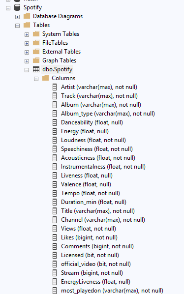

# 📊 Project_SQL_Spotify

_Reviewing the SPOTIFY catalog of Movies and Series using SQL._

---

## 📝 Project Objective

The objective of this project is to **practice SQL** by working with SPOTIFY. The goal is to **clean the data, perform CRUD operations, explore the dataset**, and **extract actionable business insights**.

---

## 🧭 Project Workflow

1. **Database Setup:** Create and populate the SQL database.
2. **CRUD Operations:** Apply Create, Read, Update, Delete operations to manage data.
3. **Data Cleaning:** Ensure data consistency and remove invalid entries.
4. **Exploratory Data Analysis (EDA):** Generate questions and explore the dataset.
5. **Insights Delivery:** Extract and present key business insights.

---

## 📂 Project Files

- **Tool Used:** SQL Server Management Studio (SSMS)
- **SQL Script:** 
- **Dataset Link:** [Movies Dataset](https://www.kaggle.com/datasets/sanjanchaudhari/spotify-dataset)
- **Format**: `.csv`
- **Schema**:

---

## 🛠️ Database Preparation & Cleaning

### ✅ Setting up the Database

The following changes were done to the DB to be ready for use. 

- Data Type change.
     - From INT to BIGINT.
     - Changing limits in the varchar data types from a numeric to max.
- Allowing Nulls from the following columns.
    - Danceability | Energy | Liveness | Valence | Duration_min | EnergyLiveness.
    - These changes were done because the information that is missing dosen't impact the analysis that we are doing.

## 🔍 Exploratory Data Analysis (EDA)

The goal of this stage is to explore trends and patterns in the dataset that can lead to actionable insights.

1. Retrieve the names of all tracks that have more than 1 billion streams.
2. List all albums along with their respective artists.
3. Get the total number of comments for tracks where licensed = TRUE.
4. Find all tracks that belong to the album type single.
5. Count the total number of tracks by each artist.
6. Calculate the average danceability of tracks in each album.
7. Find the top 5 tracks with the highest energy values.
8. List all tracks along with their views and likes where official_video = TRUE.
9. For each album, calculate the total views of all associated tracks.
10. Retrieve the track names that have been streamed on Spotify more than YouTube.
11. Find the top 3 most-viewed tracks for each artist using window functions.
12. Write a query to find tracks where the liveness score is above the average.
13. Use a WITH clause to calculate the difference between the highest and lowest energy values for tracks in each album.
14. Find tracks where the energy-to-liveness ratio is greater than 1.2.
15. Calculate the cumulative sum of likes for tracks ordered by the number of views, using window functions.

Additional analysis:
- Song with the highest tempo.
- Longest Song.

## 🎯 Key Findings

- 💡 **[Insight 1]**: 
- 📈 **[Insight 2]**: 
- 🧩 **[Insight 3]**: 

---

## 🧠 Learnings & Challenges

**Learned:**
- H
- I

**Challenges:**
- U
- D
