# 📊 Project_SQL_Spotify


_Reviewing the SPOTIFY catalog of Movies and Series using SQL._

---

## 📝 Project Objective


The objective of this project is to **practice SQL** by working with SPOTIFY. The goal is to **clean the data, perform CRUD operations, explore the dataset**, and **extract actionable business insights**.

---

## 🧭 Project Workflow

1. **Database Setup:** Create and populate the SQL database.
2. **CRUD Operations:** Apply Create, Read, Update, Delete operations to manage data.
3. **Data Cleaning:** Ensure data consistency and remove invalid entries.
4. **Exploratory Data Analysis (EDA):** Generate questions and explore the dataset.
5. **Insights Delivery:** Extract and present key business insights.

---

## 📂 Project Files

- **Tool Used:** SQL Server Management Studio (SSMS)
- **SQL Script:** 
- **Dataset Link:** [Movies Dataset](https://www.kaggle.com/datasets/sanjanchaudhari/spotify-dataset)
- **Format**: `.csv`
- **Schema**:


---

## 🛠️ Database Preparation & Cleaning

### ✅ Setting up the Database

The following changes were done to the DB to be ready for use. 

- Data Type change.
     - From INT to BIGINT.
     - Changing limits in the varchar data types from a numeric to max.
- Allowing Nulls from the following columns.
    - Danceability | Energy | Liveness | Valence | Duration_min | EnergyLiveness.
    - These changes were done because the information that is missing dosen't impact the analysis that we are doing.

## 🔍 Exploratory Data Analysis (EDA)

The goal of this stage is to explore trends and patterns in the dataset that can lead to actionable insights.

1. Retrieve the names of all tracks that have more than 1 billion streams.

```sql
select 
	track, 
	Artist, 
	Stream
from Spotify 
where Stream > 1000000000
order by Stream desc
```
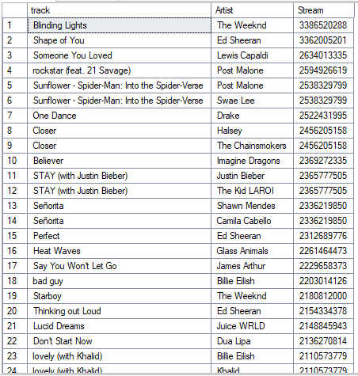

Which artist has the most songs with 1 billion streams? 

```sql
select 
	artist, 
	count(track) as Songs_Over_1B
from Spotify
where stream > 1000000000
group by Artist
order by Songs_Over_1B desc
```
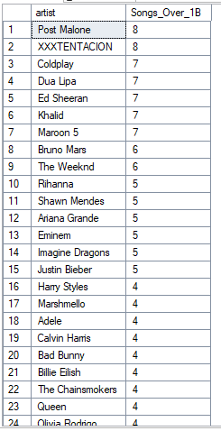

2. List all albums along with their respective artists.

```sql 
select distinct 
	album, 
	artist
from spotify
order by album desc
```
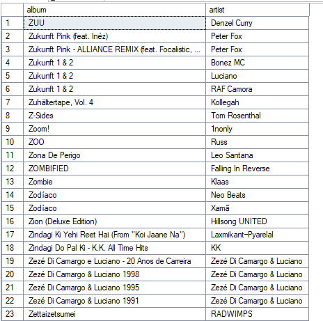

How many albums does each artist have?

```sql
select 
	top 15 
	artist, 
	count(album) as Numer_Of_Albums
from Spotify
group by Artist
order by Numer_Of_Albums desc
```
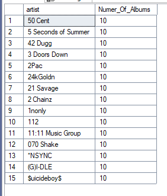

3. Get the total number of comments for tracks where licensed = TRUE.
```sql
select 
	Top 15 
	Track, 
	Comments
from Spotify
where Licensed = 'True' -- In this case, the information of True or False is saved as 1 and 0, but we can still use True. 
order by Comments desc
```
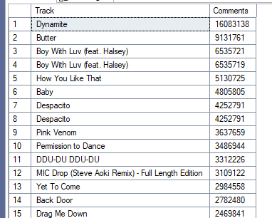

How Many Tracks are licensed?

```sql
select 
	Licensed, 
	count(*) as Number_Of_Licensed_Songs
from Spotify
group by Licensed
Order by Number_Of_Licensed_Songs desc
```
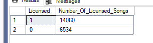

4. Find all tracks that belong to the album type single.

```sql
select 
	track, 
	Artist, 
	Album_type
from Spotify
where Album_type = 'single'
```
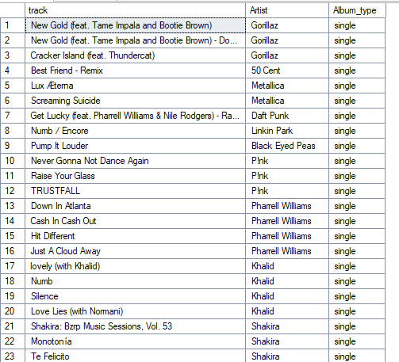

How many single album types does each artist have?

```sql
select 
	Artist, 
	count(Album_type) as Number_Of_Single_Albums
from Spotify
where Album_type = 'single'
group by Artist
Order by Number_Of_Single_Albums desc
```
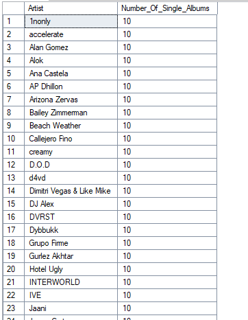

5. Count the total number of tracks by each artist.

```sql
select 
	Artist, 
	count(track) as Number_Of_Songs
from Spotify
group by Artist
Order by Number_Of_Songs desc
```
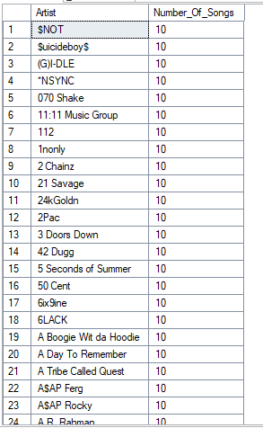

6. Calculate the average danceability of tracks in each album.

```sql
select 
	Album, 
	avg(Danceability) as Avg_Dance
from Spotify
group by album
Order by Avg_Dance desc
```
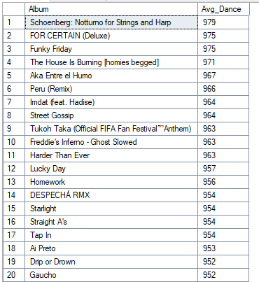

7. Find the top 5 tracks with the highest energy values.

```sql
select top 5 Track, Energy
from Spotify
Order by Energy desc
```
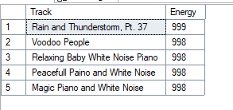

8. List all tracks along with their views and likes where official_video = TRUE.
```sql
select top 15 Track, sum(Views) as Total_Views, sum(Likes) as Total_Likes
from Spotify
where official_video = 'True'
group by Track
Order by Total_Views desc
```
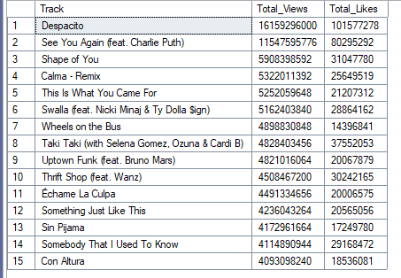

9. For each album, calculate the total views of all associated tracks.

```sql
select album, track, sum(Views) as Total_Views
from Spotify
group by album, Track
order by Total_views desc
```
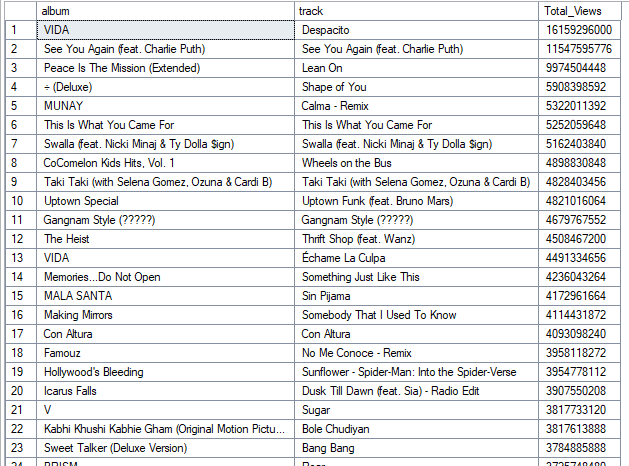

10. Retrieve the track names that have been streamed on Spotify more than YouTube.

```sql
select track, Artist, stream
from Spotify
where most_playedon = 'Spotify'
order by stream desc
```

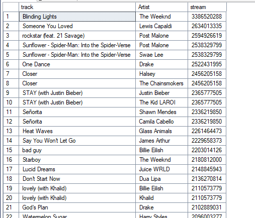

How can we validate this?

```sql
select 
	track, 
	Artist,
	sum(case when most_playedon = 'Spotify' then stream end) as Streamed_Spotify,
	sum(case when most_playedon = 'Youtube' then stream end) as Streamed_Youtube
from Spotify
group by track, artist
order by Streamed_Spotify desc
```
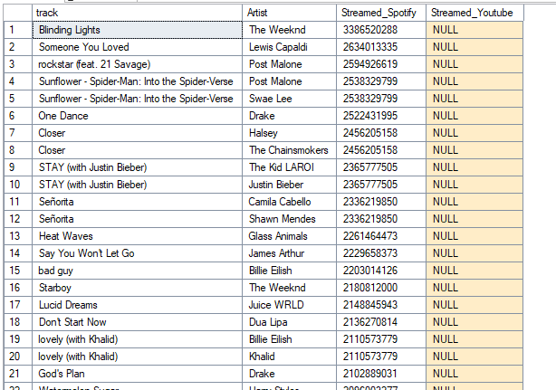

11. Find the top 3 most-viewed tracks for each artist using window functions.

```sql
with Most_viewed as (
select 
	Artist,
	Track,
	sum(Views) as Total_views,
	DENSE_RANK() over(partition by artist order by sum(views) desc) as Ranked
from Spotify
group by Artist, Track
)
select *
from Most_viewed
where ranked <= 3
order by artist, Total_views desc
```


12. Write a query to find tracks where the liveness score is above the average.

```sql
select avg(liveness) as Avg_liv from Spotify) -- 361.85
```
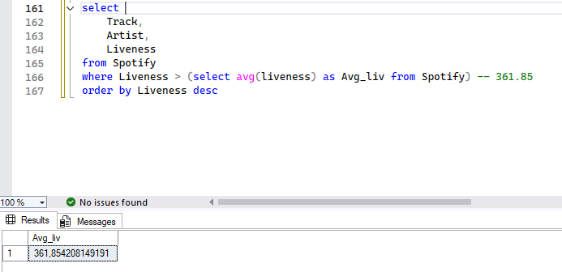

```sql
select 
	Track,
	Artist,
	Liveness
from Spotify
where Liveness > (select avg(liveness) as Avg_liv from Spotify) -- 361.85
order by Liveness asc
```
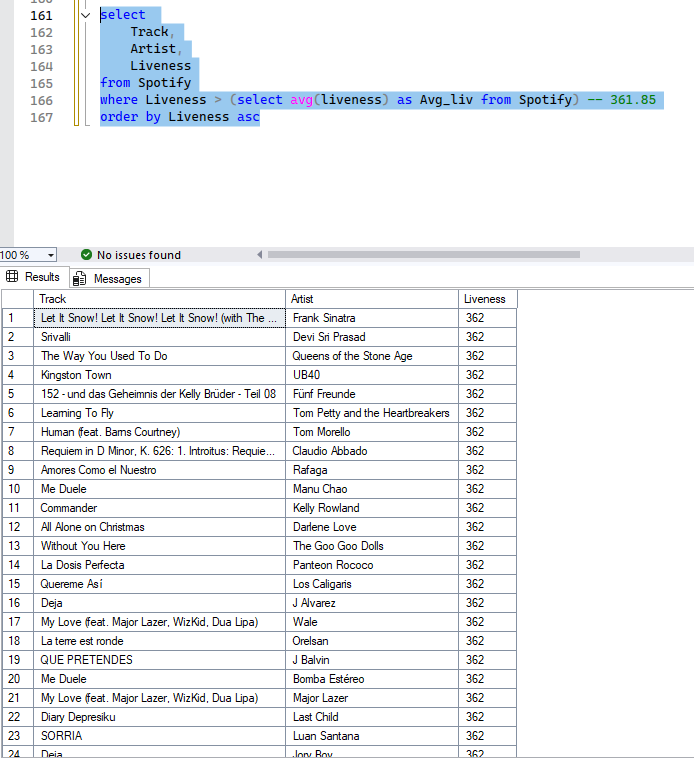

13. Use a WITH clause to calculate the difference between the highest and lowest energy values for tracks in each album.

```sql
with rank_energy_album as(
select 
	Album,
	max(Energy) as Max_Energy,
	min(energy) as Min_Energy
from Spotify
group by Album
)
select 
	Album,
	Max_Energy - Min_Energy as Energy_diff
from rank_energy_album
order by Energy_diff desc
```
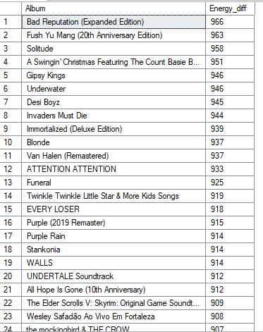

## 🎯 Key Findings

- 💡 **[Insight 1]**: Post Malone and XXXTENTACION have the most songs with over 1B views. XXXTENTACION's death in 2018 is even more impressive given the amount of success he had and the number of songs that were so well-liked.
- 📈 **[Insight 2]**: Almost 1/4 of the songs arent licensed. You need to pay royalties for 3/4 of the songs that you listen to. 
- 🧩 **[Insight 3]**: Daddy Yankee with Despacito is the highest listened to song ever. 

---

## 🧠 Learnings & Challenges

**Learned:**
- The use of CTE with dens_rank to prevent ranking properly in case of having the same numbers.

**Challenges:**
- Trying to do a different approach to prevent having nested queries.
